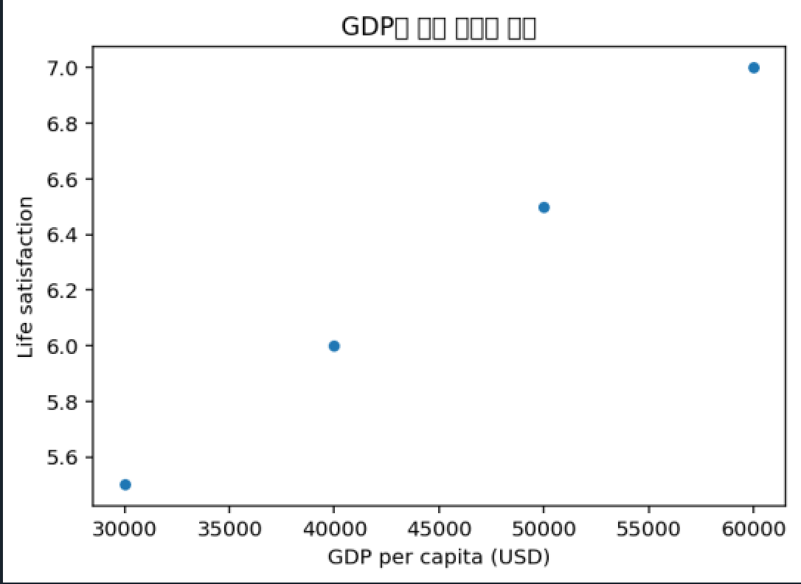

# 과제: 1. 선형 회귀와 k-최근접 이웃을 사용한 삶의 만족도 예측

## 1. 데이터 준비

아래의 데이터를 사용하여 GDP와 삶의 만족도를 생성하세요.
pandas를 사용해 데이터를 DataFrame으로 변환하세요.
matplotlib를 사용해 데이터를 시각화하세요.

```
import matplotlib.pyplot as plt
import pandas as pd

# 데이터 로드
data = {"GDP per capita (USD)": [30000, 40000, 50000, 60000],
        "Life satisfaction": [5.5, 6.0, 6.5, 7.0]}
df = pd.DataFrame(data)

# 데이터 시각화
df.plot(kind="scatter", x="GDP per capita (USD)", y="Life satisfaction")
plt.title("GDP와 삶의 만족도 관계")
plt.xlabel("GDP per capita (USD)")
plt.ylabel("Life satisfaction")
plt.show()
```

### 출력



## 2. 모델 학습

1. **선형 회귀 모델**:
   - **`LinearRegression`**을 사용해 모델을 정의하고 학습시키세요.

```
import pandas as pd

# 데이터 로드
data = {"GDP per capita (USD)": [30000, 40000, 50000, 60000],
        "Life satisfaction": [5.5, 6.0, 6.5, 7.0]}
df = pd.DataFrame(data)

from sklearn.linear_model import LinearRegression

# 독립 변수(X)와 종속 변수(y)
X = df[["GDP per capita (USD)"]].values
y = df[["Life satisfaction"]].values

# 선형 회귀 모델 생성 및 학습
model = LinearRegression()
model.fit(X, y)

# 예측
X_new = [[37655]]  # 키프로스의 1인당 GDP
prediction = model.predict(X_new)
print(f"선형 회귀 예측 결과: {prediction[0, 0]:.2f}")
```

### 출력

```
선형 회귀 예측 결과: 5.88
```

2. **k-최근접 이웃 모델**:
   - **`KNeighborsRegressor`**를 사용해 \( k=3 \)으로 모델을 정의하고 학습시키세요.

```
import pandas as pd

# 데이터 로드
data = {"GDP per capita (USD)": [30000, 40000, 50000, 60000],
        "Life satisfaction": [5.5, 6.0, 6.5, 7.0]}
df = pd.DataFrame(data)

from sklearn.neighbors import KNeighborsRegressor

# 독립 변수(X)와 종속 변수(y)
X = df[["GDP per capita (USD)"]].values
y = df[["Life satisfaction"]].values

# k-최근접 이웃 모델 생성
model = KNeighborsRegressor(n_neighbors=3)
model.fit(X, y)

# 예측
X_new = [[37655]]  # 키프로스의 1인당 GDP
prediction = model.predict(X_new)
print(f"k-최근접 이웃 예측 결과: {prediction[0, 0]:.2f}")
```

### 출력

```
k-최근접 이웃 예측 결과: 6.00
```

## 결과

선형 회귀의 경우 데이터들의 값을 가지고 직선 함수를 만들어 다른 데이터들을 판단하기에 수치적 데이터를 판단하는데 사용하면 좋을 것으로 생각됨.

k-최근접 이웃 모델의 경우 근처의 군집을 찾아 데이터를 판단하기에 분류 작업을 진행하는데 탁월해 보임
